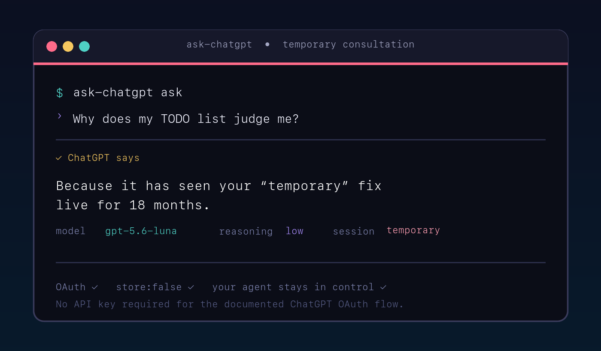
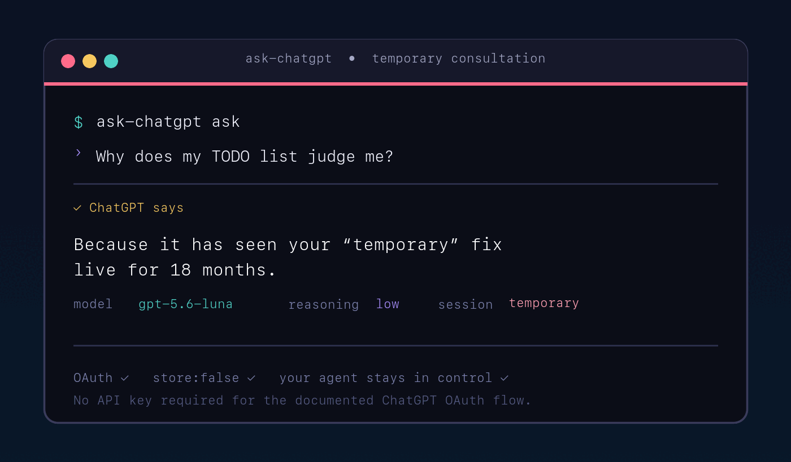

# ask-chatgpt

**Your coding agent gets a second opinion without leaving the terminal.**

Ask ChatGPT from Qwen Code, OpenCode, Pi, Gemini CLI or Claude Code—or let ChatGPT power the agent loop—using your existing ChatGPT sign-in.

**One plugin. Five coding harnesses. No API-key juggling.** No copied transcripts by default. One install gives every supported harness the same OAuth core, consultation tools, provider gateway, model discovery, streaming, attachments, citations and tool-call handoffs.

<p align="center">
  
</p>

<p align="center"><em>“Because it has seen your ‘temporary’ fix live for 18 months.”</em></p>

<p align="center">
  <a href="https://github.com/aeltawela/ask-chatgpt/actions/workflows/ci.yml"></a>
  <a href="https://img.shields.io/github/v/release/aeltawela/ask-chatgpt?display_name=tag"></a>
  <a href="LICENSE"></a>
</p>

## Pick your mode

| Mode | What happens | Use it when |
|---|---|---|
| **Ask ChatGPT** | Your current agent stays in charge and ChatGPT returns an answer, citation or proposed tool call. | You want a second opinion, review or fresh idea. |
| **ChatGPT as provider** | A loopback gateway lets a supported harness route its main model requests through ChatGPT OAuth. | You explicitly want ChatGPT to run the model loop. |

Both modes share one login and one core. Consultation is temporary unless you explicitly persist a session.

## Quick start

The shortest Qwen Code path:

```sh
qwen extensions install https://github.com/aeltawela/ask-chatgpt
```

Restart Qwen, call its bundled `chatgpt_login` tool, finish the official browser sign-in, then ask:

```text
/ask-chatgpt:ask-chatgpt Explain this error without touching my files.
```

The one extension contains both skills:

- `ask-chatgpt` — a temporary second opinion while your agent keeps control.
- `ask-chatgpt-provider` — provider setup and loopback gateway guidance.

<p align="center">
  
</p>

**Privacy default:** question content stays in process memory and upstream requests use `store: false`. Sessions are saved locally only when `--persist` is explicit. OAuth credentials are encrypted locally with owner-only permissions. The calling client can still keep its own transcript; this plugin cannot change OpenAI retention policy.

## Install in another harness

Use each client’s normal extension or plugin manager. The package includes the shared core and does not require a separate global MCP installation for consultation mode.

| Harness | Install | Update | Uninstall |
|---|---|---|---|
| Qwen Code | `qwen extensions install https://github.com/aeltawela/ask-chatgpt` | `qwen extensions update ask-chatgpt` | `qwen extensions uninstall ask-chatgpt` |
| OpenCode | `opencode plugin add github:aeltawela/ask-chatgpt` | `opencode plugin update ask-chatgpt` | `opencode plugin remove ask-chatgpt` |
| Pi | `pi install git:github.com/aeltawela/ask-chatgpt@v0.1.12` | `pi update --extensions` | `pi remove git:github.com/aeltawela/ask-chatgpt` |
| Gemini CLI | `gemini extensions install https://github.com/aeltawela/ask-chatgpt` | `gemini extensions update ask-chatgpt` | `gemini extensions uninstall ask-chatgpt` |
| Claude Code | `claude plugin marketplace add aeltawela/ask-chatgpt` then `claude plugin install ask-chatgpt@ask-chatgpt` | `claude plugin update ask-chatgpt@ask-chatgpt` | `claude plugin uninstall ask-chatgpt@ask-chatgpt` |

After restarting the harness, call `chatgpt_login`. It opens the official Sign in with ChatGPT link, waits for the localhost callback, validates PKCE/state/nonce and identity, then encrypts credentials locally. Use `chatgpt_models` to inspect the account’s model catalog. Qwen users should call this plugin’s login tool; Qwen’s MCP-server OAuth action is for remote MCP servers and is separate.

If a browser callback cannot work, run `node <plugin-directory>/src/cli.mjs login --manual-token` in a local terminal and paste into the hidden prompt. Never pass tokens in arguments, environment variables, chat, MCP calls or settings.

The default data directory is `~/.config/ask-chatgpt` (or `$XDG_CONFIG_HOME/ask-chatgpt`). Set `ASK_CHATGPT_HOME` for another private location. `CHATGPT_PROVIDER_HOME` remains accepted as a migration alias.

## Ask ChatGPT from a terminal

```sh
npm install --global github:aeltawela/ask-chatgpt
ask-chatgpt ask
printf '%s' 'Review this code path for race conditions.' | ask-chatgpt ask
ask-chatgpt ask --question 'Explain this diagram' --file ./diagram.png --json
ask-chatgpt ask --question 'Compare the alternatives' --persist
ask-chatgpt saved
ask-chatgpt export --session SESSION_ID
ask-chatgpt delete --session SESSION_ID
```

Start `ask-chatgpt mcp` for the stdio MCP server. It exposes `ask_chatgpt`, `chatgpt_models`, `chatgpt_saved_sessions`, `chatgpt_delete_session` and `chatgpt_export_session`. The host reviews and executes proposed tool calls.

## Use ChatGPT as the provider

```sh
ASK_CHATGPT_GATEWAY_TOKEN="$(node -e 'process.stdout.write(require("node:crypto").randomBytes(32).toString("base64url"))')" \
  ask-chatgpt serve --protocol openai
```

The gateway binds only to loopback and requires the generated bearer token. Configure the client using the matching guide under [`integrations/`](integrations/). It translates OpenAI Chat Completions, Anthropic Messages and Gemini `generateContent` into the shared Responses path. Keep the token out of shell history, settings, logs and version control. `CHATGPT_PROVIDER_GATEWAY_TOKEN` remains accepted for migration.

## Capabilities and limits

```sh
ask-chatgpt capabilities
```

The documented OAuth route supports model discovery, text, model-supported image/file input, streaming, web search where available, structured output where available and custom function tools. It does not provide ChatGPT history, image generation, audio/video, transcription, File Search, Code Interpreter, native computer use, hosted connectors or Responses `tool_search`. Claude Code provider mode is a community adapter path; Anthropic does not support routing Claude Code to non-Claude models. See the [Claude integration note](integrations/claude/README.md).

## Model selection

Model selection defaults to the available Luna model. Astra is selected only for an explicitly highly difficult task or an explicit model choice; high reasoning effort alone keeps Luna. Automatic mode uses the calling agent’s effort when supplied and otherwise makes a small classification request. Results report `model`, `reasoning`, `difficulty` and `classified` without exposing account identity.

## Development and contribution

```sh
npm test
npm run check
```

Tests use mocked OAuth accounts and Responses streams; they never spend ChatGPT plan usage. Read [CONTRIBUTING.md](CONTRIBUTING.md) before changing code. Please [open an issue](https://github.com/aeltawela/ask-chatgpt/issues/new/choose) for bugs or feature ideas, and [open a pull request](https://github.com/aeltawela/ask-chatgpt/compare) for reviewed changes. Never put tokens, personal account details, private prompts or transcripts in issues, fixtures or commits. See the [compatibility matrix](docs/compatibility.md) and [security and privacy guide](docs/security-and-privacy.md).

## Help it grow

If ask-chatgpt saves you time, [star the repository](https://github.com/aeltawela/ask-chatgpt), share the terminal demo, [tell us which harness to verify next](https://github.com/aeltawela/ask-chatgpt/discussions/2), add a conformance test, or improve an integration guide.

## Why developers use it

- **Ask, review, explain:** get a fast independent view while your current agent remains in control.
- **Private by default:** temporary turns stay in memory and upstream requests use `store: false`.
- **One normal install:** Qwen Code, OpenCode, Pi, Gemini CLI and Claude Code use the same shared core.
- **Ready for serious workflows:** model discovery, Luna-first reasoning, streaming, files, images, citations and host-approved tool calls.
- **Reversible provider mode:** expose a loopback OpenAI, Anthropic or Gemini gateway only when you explicitly choose it.

## License

ask-chatgpt is free and open source under the **GNU General Public License v3.0 or later**. See [LICENSE](LICENSE). Distributed modified versions must provide the corresponding source under the same terms.
